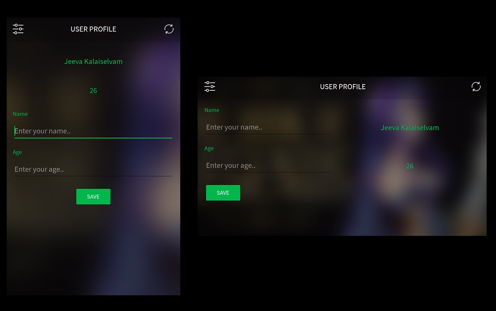

# User Information

This is a simple android application using Datastore Preferences to store user information using Coroutines and Flows

## Impementation

### 1. Coroutines
### 2. Flow
### 3. Datastore Preferences
### 4. LiveData

# Screenshots

